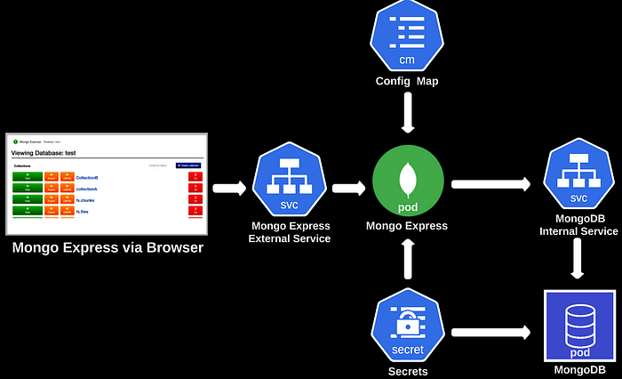
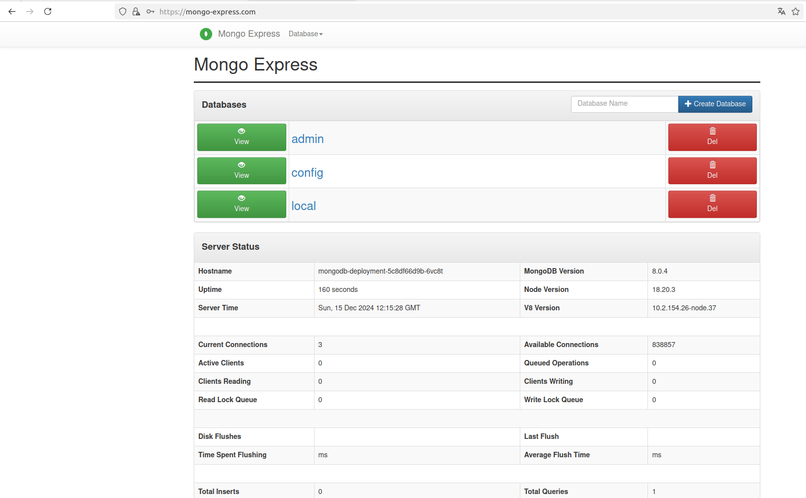

# README: MongoDB et Mongo Express sur Kubernetes

## Introduction

Ce projet déploie **MongoDB** et **Mongo Express** sur Kubernetes. MongoDB est une base de données NoSQL tandis que Mongo Express est une interface web permettant de gérer les bases de données MongoDB. L’objectif est de mettre en place une architecture scalable, sécurisée et automatisée.

Ce guide explique comment configurer votre environnement et déployer les fichiers YAML dans le bon ordre pour faire fonctionner l’application.

---

## Architecture

Voici une représentation de l'architecture mise en place pour ce projet :



### Explication des composants :
1. **Navigateur** : Reçoit les requêtes de l'utilisateur pour accéder à Mongo Express.
2. **Ingress** : Gère les requêtes HTTP et redirige le trafic vers Mongo Express.
3. **Mongo Express External Service** : Expose Mongo Express pour une communication externe.
4. **Pod Mongo Express** : Conteneur exécutant l'interface web Mongo Express.
5. **MongoDB Internal Service** : Service permettant à Mongo Express de se connecter à MongoDB.
6. **Pod MongoDB** : Conteneur exécutant la base de données MongoDB.
7. **Persistent Volume (PV/PVC)** : Assure la persistance des données stockées par MongoDB.

Le flux de requêtes suit ce chemin :
- Le navigateur envoie une requête HTTP via l'Ingress.
- L'Ingress redirige la requête vers le **Mongo Express External Service**.
- Le **Service** connecte Mongo Express au Pod Mongo Express.
- Mongo Express communique ensuite avec MongoDB via le **MongoDB Internal Service**.
- Les données de MongoDB sont sauvegardées dans un **Persistent Volume**.

---

## Prérequis

Avant de commencer, assurez-vous d'avoir les outils suivants installés sur votre machine locale :

1. **Kubernetes CLI (kubectl)** : Pour interagir avec le cluster Kubernetes.
2. **Minikube** : Pour configurer un cluster Kubernetes local.
3. **Docker** : Pour gérer les conteneurs et images Docker.
4. **Un éditeur de texte** comme VS Code pour visualiser et modifier les fichiers YAML si besoin.

Vérifiez les installations avec les commandes suivantes :

- `kubectl version --client`
- `minikube version`
- `docker --version`

---

## Étapes détaillées

### 0. Démarrer Minikube

Lancez un cluster Kubernetes local en utilisant Minikube :

```bash
minikube start
```

Vérifiez que le cluster est en cours d’exécution :

```bash
kubectl get nodes
```
### 1. Se placer dans mongo-express-deployment
```bash
 cd mongo-express-deployment
```
### 2. Créer le secret pour MongoDB

Le premier fichier YAML à appliquer est `mongodb-secret.yaml`. Il contient les informations sensibles (nom d’utilisateur et mot de passe) pour MongoDB encodées en base 64.

Le fichier est configuré avec :

- Nom d'utilisateur : `username`
- Mot de passe : `password`

Appliquez le fichier :

```bash
kubectl apply -f mongodb-secret.yaml
```

### 3. Créer le volume persistant pour MongoDB

MongoDB a besoin d’un stockage persistant pour sauvegarder ses données. Appliquez les fichiers `mongodb-pv.yaml` et `mongodb-pvc.yaml` dans cet ordre :

- Créez le volume persistant :

  ```bash
  kubectl apply -f mongodb-pv.yaml
  ```

- Créez la demande de volume persistant (PVC) :

  ```bash
  kubectl apply -f mongodb-pvc.yaml
  ```

### 4. Déployer MongoDB

MongoDB peut maintenant être déployé avec le fichier `mongodb-deployment.yaml`. Ce fichier configure le déploiement et le service associé.

- Appliquez le fichier :

  ```bash
  kubectl apply -f mongodb-deployment.yaml
  ```

- Vérifiez que MongoDB est déployé correctement :

  ```bash
  kubectl get pods
  ```

  Assurez-vous que le Pod `mongodb-deployment` est en statut `Running`.

### 5. Créer le ConfigMap pour Mongo Express

Mongo Express a besoin de l’URL de MongoDB pour fonctionner. Cette URL est définie dans `mongodb-configmap.yaml`.

Appliquez le fichier :

```bash
kubectl apply -f mongodb-configmap.yaml
```

### 6. Créer le secret pour Mongo Express

Mongo Express utilise un mot de passe pour son interface web. Ce mot de passe est stocké dans `mongo-express-secret.yaml` et encodé en base64.

Le fichier est configuré avec :

- Nom d'utilisateur : `admin`
- Mot de passe : `password`

Appliquez le fichier :

```bash
kubectl apply -f mongo-express-secret.yaml
```

### 7. Déployer Mongo Express

Mongo Express peut maintenant être déployé avec `mongo-express-deployment.yaml`.

- Appliquez le fichier :

  ```bash
  kubectl apply -f mongo-express-deployment.yaml
  ```

- Vérifiez que Mongo Express est déployé correctement :

  ```bash
  kubectl get pods
  ```

  Assurez-vous que le Pod `mongo-express-deployment` est en statut `Running`.

### 8. Configurer l’Ingress pour Mongo Express

Pour rendre Mongo Express accessible via un navigateur web, configurez un Ingress avec `mongo-express-ingress.yaml`.

- Appliquez le fichier :

  ```bash
  kubectl apply -f mongo-express-ingress.yaml
  ```

- Activez l’addon Ingress de Minikube :

  ```bash
  minikube addons enable ingress
  ```

- Vérifiez que l’Ingress fonctionne :

  ```bash
  kubectl get ingress
  ```

### 9. Accéder à Mongo Express

Une fois l’Ingress configuré, Mongo Express est accessible via l’URL suivante :

```
http://mongo-express.com
```

Ajoutez le domaine à votre fichier `hosts` local pour résoudre `mongo-express.com` :

- Récupérez l’IP de Minikube :

  ```bash
  minikube ip
  ```

- Ajoutez une entrée à `/etc/hosts` :

  ```
  <MINIKUBE_IP> mongo-express.com
  ```

Ensuite, ouvrez votre navigateur et accédez à l’URL.

---

## Conclusion

En suivant ces étapes, vous avez déployé MongoDB et Mongo Express sur Kubernetes. Ce projet vous permet de comprendre les bases de l’orchestration Kubernetes, de la persistance des données et de la gestion des configurations sensibles.

Si vous avez des questions ou souhaitez apporter des améliorations, n’hésitez pas à me contacter ou à consulter la documentation Kubernetes officielle.

Bon déploiement ! 🚀

